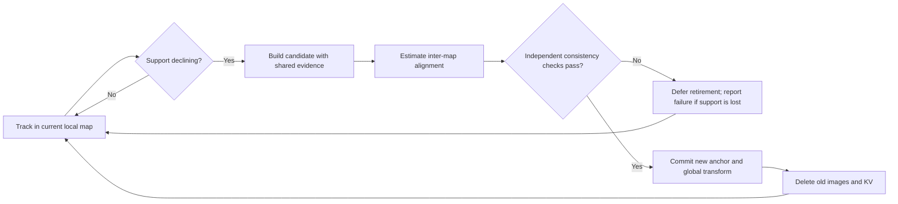

# Dynamic local maps: segmentation, Übergang and history retirement

Research note, 2026-10-01. User-selected direction to explore and document;
**not an implemented policy, selected runtime protocol or submitted job**.
Experiment records and numerical evidence remain in [FINDINGS.md](FINDINGS.md),
especially “Matched-window native versus independent resets”, “Independent
two-keyframe office segments26115” and “Whole-keyframe office pilot26111”.

## Research question

Can a frozen reconstruction/tracking model maintain accurate continuous motion
with a small local image bank, start a new local map before support collapses,
connect it reliably to the existing trajectory, and then retire the previous
images and KV state? The objective is useful geometric support per unit of state
and computation, not maximizing retained history or minimizing frame count alone.

The stronger claim that irrelevant history actively hurts accuracy is separate.
A successful bounded system need only preserve acceptable accuracy at lower cost;
it does not have to beat every native metric or prove harmful interference.
Conversely, cost savings alone do not establish acceptable tracking.

## What led here, and what the evidence actually says

1. Post-rebuild KV compression and pre-rebuild image eviction have different costs.
   The previous online-cache experiment rebuilt all historical images before
   gathering KV rows. Whole-image eviction changes reconstruction inputs too.
2. Bank pilot26111 retained frame0 and the newest pair, comparing eight-frame
   recent/relevance banks against native. Appearance relevance was normalized
   mean encoder-feature similarity, not complementary geometric coverage. It
   reduced reconstruction state/cost but failed the selected accuracy gate and
   lost to recency. Its predecessor protection worked; that does not validate its
   relevance proxy. This was not complete history retirement or dynamic anchoring.
3. User inspected office content at25-frame intervals and marked275,575,700,975,
   1400. These are approximate visual landmarks, not exact transition times,
   GT segmentation labels, or an optimized boundary oracle. Do not assume a
   justified ±12-frame error bound: scene transitions can span many frames.
4. Experiment26115 restarted independently in each marked region, retaining its
   first frame and frame49 thereafter. The choice was a fixed spacing, **not
   random sampling**, and not optimized for overlap, baseline or view quality.
   All prior state was absent; this demonstrated execution of local restarts,
   not a continuous global trajectory or successful inter-map scale transfer.
5. The matched-window reevaluation refitted native separately on exactly those
   regions. Reset improved some ATE/p99 values, but native had lower translation
   RPE in every region and much stronger late tracking. No claim of general
   harmful-history causality follows. Small local banks are promising in some
   regions; a frozen pair is insufficient over all selected intervals.
6. The long final segment deteriorated well after its last reconstruction. This
   motivates monitoring support and refreshing views *inside* a semantic region,
   as well as testing transitions between regions. Reanchoring alone is not a
   remedy for an unrepresentative pair.

Exact numbers, matched-comparison caveats and artifact provenance are canonical
in FINDINGS; do not compare short independently aligned ATE with a longer
single-fit native ATE. Reports: `cluster_results/kvt_office_segments_26115/`,
its `matched_native/` subdirectory, and `cluster_results/kvt_bank_26111/`.
Full frame viewer: `cluster_results/office_full_sequence/index.html`.

## Separate the decisions

| Decision | Required question | Insufficient substitute |
|---|---|---|
| Admission | Does this new image add usable constraints? | Add every visually novel frame |
| Retention | Which views jointly support current tracking? | Keep the most similar global descriptors |
| Segmentation | Is the current local map losing support, while a handoff is still possible? | A fixed content label or cache age alone |
| Anchor | Which well-supported local frame defines the new coordinates? | Permanently keep frame0, or always choose a blurred transition frame |
| Übergang | Can common evidence connect the two coordinate systems reliably? | Force one camera pose to agree and assume scale |
| Retirement | Has the handoff passed validation so old image/KV state can be deleted? | Delete first, discover loss of overlap afterward |

The first arriving frame in a new region is a useful controlled initial anchor
choice, not a universal optimum. New-segment geometry cannot be built from future
views online: either bootstrap from the current image, with its uncertainty,
or delay commitment until a useful second view arrives. Record that latency.

## Candidate mechanism, not yet selected

Maintain one active local map with a fixed image/KV budget. Keep the global
coordinate transform outside the neural cache. A transition temporarily holds
an old bank plus a small candidate bank; both count toward the peak budget.

This is bounded transactional replacement, not unconditional deletion at a visual
cut. Transition duration/retry count must be bounded before implementation. If
both tracking and connection fail, report lost tracking or a disconnected map;
do not silently present it as a globally continuous reconstruction. Keeping the
old bank temporarily means bounded overlap, not an unbounded backup archive.

### Segmentation signal

Start with geometric support: spatial coverage and consistency of correspondences
between the current view and retained views. Useful evidence includes inlier
coverage across the image, reprojection agreement, and whether a candidate pair
has enough common structure and baseline to constrain reconstruction. A high
match count confined to one small region is not broad support. Pure rotation,
blur, occlusion, moving objects and repeated texture require explicit diagnosis.

Appearance novelty can nominate a transition; it cannot certify geometric
disconnection. Model confidence is not calibrated overlap or pose uncertainty.
Use persistence/hysteresis to avoid switching on a single bad frame, but do not
invent thresholds from the current GT errors. No score fusion weights, persistence
length, threshold grid or learned detector is selected here.

The essential objective is **handoff readiness before loss of support**. A useful
cut may precede or follow a human content label, and several geometric local maps
may be needed inside one semantic region.

### Übergang and coordinate contract

Let G_old map old local coordinates to global, and H map candidate-local points
to old-local points. For an adequate similarity model:

`X_old = s R X_new + t`, `G_new = G_old composed with H`.

Compose scale, rotation and translation consistently. Camera centres obey the
similarity transform; camera orientation uses the rotation, not a scaled rotation
matrix. Do not multiply a Sim(3) into a camera SE(3) and treat the scaled3x3 block
as a valid orientation. Previously emitted global poses are not rewritten simply
to hide a discontinuity. Inter-map alignment must use predicted common evidence,
never GT or evaluation-time per-segment fits.

One shared camera pose does not determine relative scale. A shared image with
predicted3D pointmaps in both reconstructions supplies many correspondences and
can support scale fitting, if geometry is sufficiently informative and consistent.
Two separated shared camera centres plus corresponding orientations can constrain
scale in principle; near-zero baseline makes that route unstable. More than one
shared view is preferable for validating the estimate, even if only a small pair
remains after commitment. An image merely visible in both regions is not itself
a verified3D correspondence set.

Candidate first bridge: reconstruct a recent shared image in both banks, obtain
same-pixel point correspondences from static, confident geometry, robustly fit
H, then validate on spatially held-out points or another shared view. Report
residuals normalized by scene scale, inlier spatial coverage, estimated scale,
conditioning and disagreement of shared-camera poses. Held-out points from one
image are correlated; another view provides a stronger check. Residual and
scale-stability thresholds must be chosen and recorded before the run.

Sim(3) sufficiency is a hypothesis: independently predicted maps may distort
nonuniformly. If no consistent similarity fits the overlap, that is a failed
bridge model, not automatically a bad boundary. Do not silently switch to an
affine/projective transform; it changes the camera/geometry problem and scope.

### State after retirement

Retire old RGB/masks, descriptors used only for selection, old reconstruction
points held as working state, and old K/V storage. Persist the current global
transform and minimal transition provenance. Saving past poses/results to an
output archive is distinct from retaining them as online attention/retrieval
memory. Report output growth separately from active and transient working memory.

Irreversible removal of all old visual evidence gives up later visual loop
closure/relocalization to those maps. A transform chain alone cannot rediscover a
place or correct drift. A future compact place-recognition store would be an
additional memory tier and a separate experiment, not free global consistency.
The first candidate should be described as continuous odometry with bounded
working history, not a complete loop-closing SLAM system.

## Pi3 integration findings

- `kv_tracker/main.py` already slices image/mask/ID rows before dense reconstruction
  in the keyframe-cache path. Reanchoring must change coordinate bookkeeping too.
- `kv_tracker/kv_tracker/pi3_utilts.py::pi3_inference` normalizes multi-image
  reconstruction to its first predicted camera. Query poses later pass through
  `origin_offset` and `scene_origin` in `main.py`. These local normalizations must
  be distinguished from the persistent local-to-global transform to avoid double
  normalization or subtracting a centre from the previous map.
- Its single-image reconstruction branch returns `origin_offset=None`; simply
  deleting all but the arriving image in that path is not a safe anchor switch.
  The existing duplicated-image bootstrap is a separately understood convention.
- Camera-only queries do not currently return the pointmaps needed for the
  proposed bridge. Additional geometry inference/reconstruction at transition
  time has real latency/memory cost and must be charged.
- The current BankCache asserts frame0 retention; the new mechanism cannot be
  implemented by merely changing its victim score. Existing append/refresh
  experiments also do not implement this global/local coordinate contract.
- Prior segment archives have disjoint frame sets and no common-view pointmap
  pair at their boundaries. They support diagnostics but cannot validate the
  proposed geometry handoff without new, explicitly selected runtime work.

Model-side changes belong in the KV-Tracker fork; orchestration and protocols in
tracked tools. Mac work remains source/artifact inspection and static checks.

## Prior work and what might be distinctive

Local maps and dynamic references are not new to SLAM. Do not present “cut history”
alone as a novel method. The potential contribution here is a validated causal
support/transition policy for a frozen dense-reconstruction cache with explicit
image/KV retirement and measured accuracy–memory–latency tradeoffs.

- **ORB-SLAM3** maintains multiple maps and can merge/reuse them. It establishes
  relevant multi-map context; it does not support our stronger deletion premise.
  [Primary paper](https://arxiv.org/abs/2007.11898).
- **SLAM3R** constructs overlapping local clips and registers their reconstructions
  globally through learned components. Relevant to local/global separation; not
  evidence that Pi3 can be restarted with a simple transform and no training.
  [Primary paper](https://arxiv.org/abs/2412.09401).
- **VGGT-SLAM / VGGT-SLAM2.0** use local submaps and shared-frame connections.
  The authors explain why Sim(3) can be insufficient for VGGT submaps and discuss
  projective alignment and its degeneracies. This is a warning to measure Pi3's
  overlap fit, not a reason to assume Pi3 needs SL(4).
  [Author explanation](https://gtsam.org/2026/06/24/vggt-slam.html),
  [official repository](https://github.com/MIT-SPARK/VGGT-SLAM).

Sources inspected2026-10-01. This is a targeted positioning review, not an
exhaustive novelty search. No external implementation installed or executed.

## Staged exploration and decision gates

These are proposed steps, not approval for a run matrix.

1. **Pin down the bridge contract first.** Choose one of the manual boundary
   neighborhoods with visible overlap. Specify exactly which shared images,
   which3D outputs and frame conventions, fit/validation rules, maximum two-bank
   overlap, and commit timing. The25-frame inspection cadence is a cue to inspect
   neighbors, not permission for an automated threshold/window sweep.
2. **One boundary pilot before full-sequence segmentation.** Compare a fixed
   recent-bank control and one reanchoring candidate with matched steady budget
   and shared causal candidate schedule. Keep native as the accuracy reference.
   Decide the concrete bank size and maximum bridge budget before implementation;
   two is the existing diagnostic, not an assumed universal optimum. No automatic
   successor behind an unreviewed pilot.
3. **Validate continuity and retirement.** First establish no-switch identity and
   frame-convention/scale composition tests. Runtime must show reliable shared
   evidence, a valid transform, raw global poses on both sides of commit, bounded
   active/transient bytes, and actual removal of old image/KV backing storage.
   Log failures, delays and rejection reasons instead of hiding failed handoffs.
4. **Only then automate segmentation and anchor selection.** Use causal support,
   choose parameters on separate development data, and test whether it cuts early
   enough while avoiding unnecessary handoffs. Human boundaries remain qualitative
   landmarks, not exact targets. A periodic/reset-at-budget control distinguishes
   benefit of the trigger from benefit of bounded recency alone.
5. **Continuous evaluation.** One full-trajectory alignment, global ATE, translation
   RPE/p99, rotation, transition-window errors, failure/recovery frequency, total
   and tail latency, bridge overhead and peak memory. Preserve the earlier5%
   joint native-relative accuracy criterion unless explicitly revised. Also show
   the tradeoff rather than equating a failed tolerance with no research value.
   Independently fitted segment scores are diagnostic only; never stitch their
   GT fits into the online result.

To claim harmful-history causality, a later controlled intervention must hold
reference/transform, query window and rebuild/admission opportunities fixed while
changing access to the suspected old history. That is distinct from demonstrating
a useful reset system. Do not silently add that intervention to the first pilot.

## Open decisions and next action

Recommended next design step: select one overlap-rich manual boundary neighborhood
and specify a small, auditable geometry bridge. Before runtime, settle the steady
and transient budgets, support source, shared views, fit acceptance criteria and
maximum wait/rejection behavior. Existing evidence cannot choose those values.

No new model edit, dataset, checkpoint, cluster job, training, grid search or
automatic full run is selected by this note. The completed experiments remain
valid negative/mixed evidence; this direction is a new testable hypothesis.
